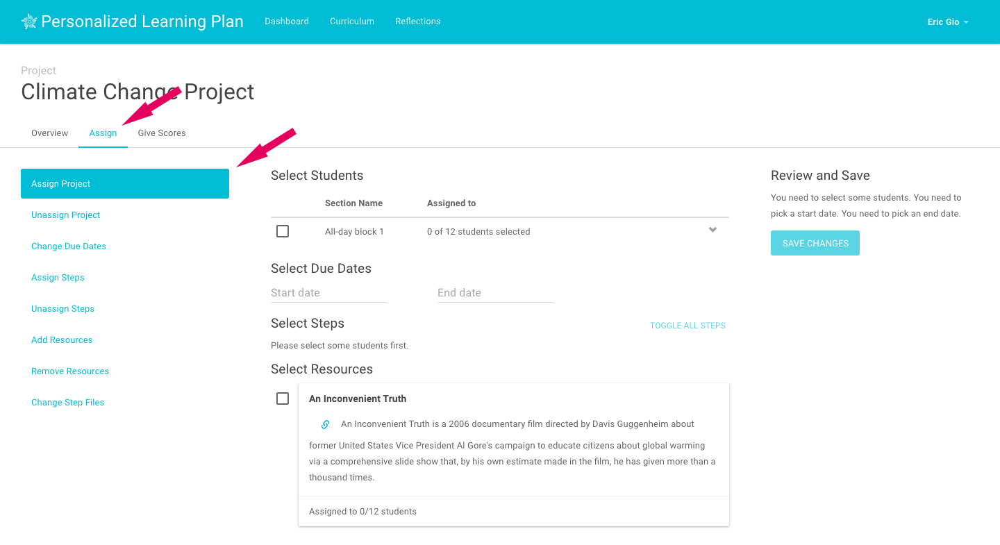

# Assigning a Project
To assign a project navigate to the 'Assign' page. You’ll see that the 'Assign' tab is highlighted as well as the menu item for 'Assign Project'.

Next, select the students you would like to assign the project to. You’ll see all the sections that you teach listed. You can select all of the students in each section by just selecting the checkbox next to the section. If you instead want to select only some students in a section, you can expand the section by clicking the arrow to the right and selecting specific students.
